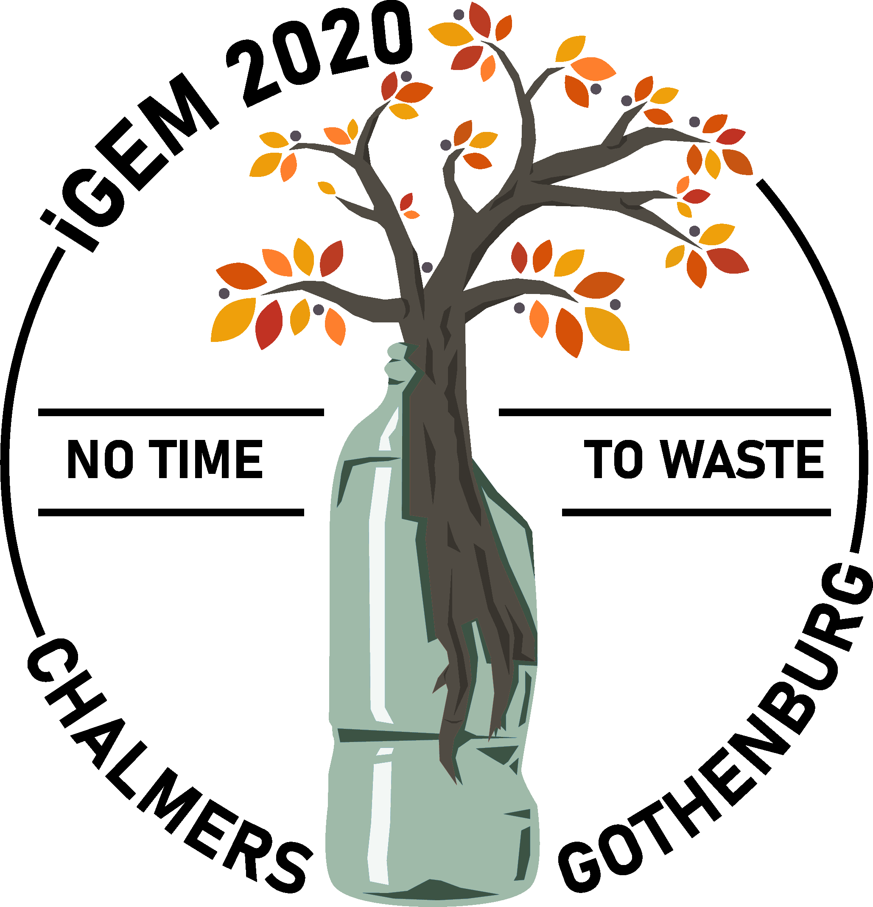

# Chalmers-Gothenburg

This is the repository for the project *No Time to Waste* developed at Chalmers (Gothenburg) as part of the iGEM competition 2020. Here, you can find the code we used to perform all our dry-lab analysis. Welcome!

## Project Overview
*No Time To Waste* aims to enzymatically degrade the plastic fibers that are present in clothes, such as elastane, to release the natural materials that can be reused to produce new clothes.
By doing this, we would provide a mean to recycle denim and other garments. Hence, we would not only prevent the accumulation of textiles in landfills, where they present a problem and immobilization of resources, but also contribute to reduce the production of cotton, a process which requires tremendous amounts of energy.
To do this, we used the power of synthetic biology to give our bacterial strain the capabilities of other bacteria that have been shown to be able to degrade plastic. 

## Modelling Overview
We wanted our modelling approach to be integrated with different aspects of our project. On one hand, we decided to model the degradation process in order to get a solid start in the lab and to explore the possibilities to implement our idea in different ways. On the other hand, we wanted a different perspective and look at the problem of plastic contamination from a larger scale.
Here, you can explore our different approaches! 

### [Metagenomics](https://github.com/igemsoftware2020/Chalmers-Gothenburg/tree/master/metagenomics_github)
First, we collected literature data from different shotgun metagenomic experiments so that we could converge them and find abundance of bacterial species, and the functionality of the communities, in different landfills or wastewater collections around the world. Our goal was to collect a database that could serve both to our purposes, but also as benchmark for future researchers to be able to come back and provide a perspective of the potential of microbial plastic degradation. Furthermore, this helped us to get a better overview of the research that has been carried out in the topic so far.   

### [Genome Scale Modelling](https://github.com/igemsoftware2020/Chalmers-Gothenburg/tree/master/GEM)
Secondly, we wanted to look at the complete metabolic network of E. coli, to learn how efficiently the strain could degrade our substrate or how we could tweak the bacterial metabolism to optimize the production of the enzymes. For this purpose, we used a genome scale model (GEM) to simulate the whole metabolism of the bacteria, adding the enzymes of interest in silico. 

### [Kinetic modelling](https://github.com/igemsoftware2020/Chalmers-Gothenburg/tree/master/ODEModels) 
Lastly, we decided to model the degradation of the elastane fibres, the main goal of our project, using a kinetic model based on ordinary differential equations (or ODE).  By simulating the degradation, we could find the bottlenecks of the process. By targeting the bottlenecks in the lab, it would be possible to accelerate the degradation of elastane.  

*Go to the folders of the different experiments to find out more!* 
